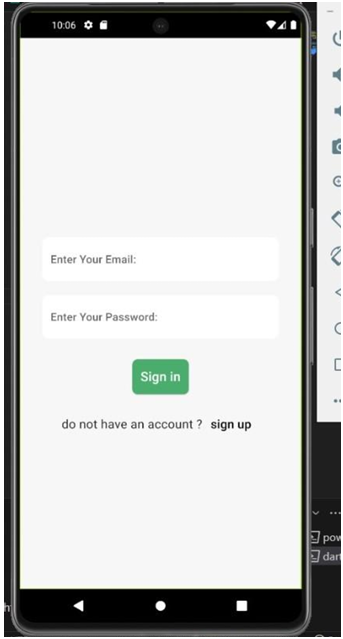
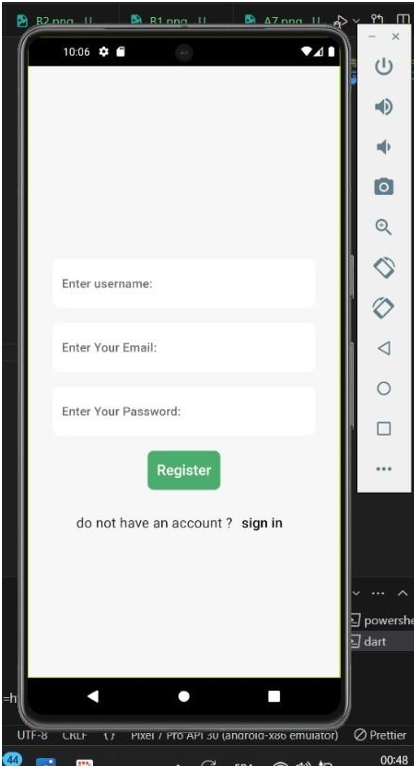
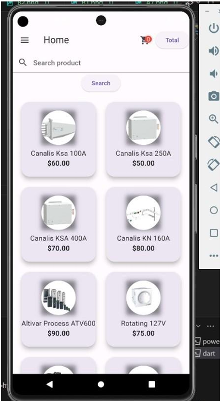
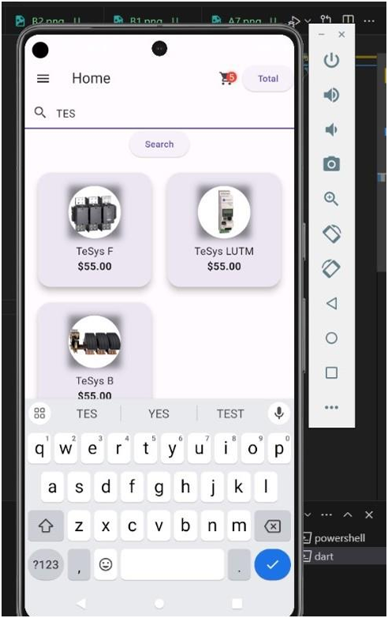
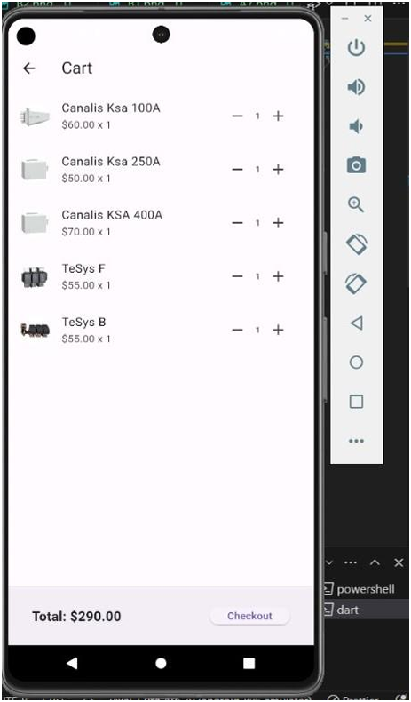
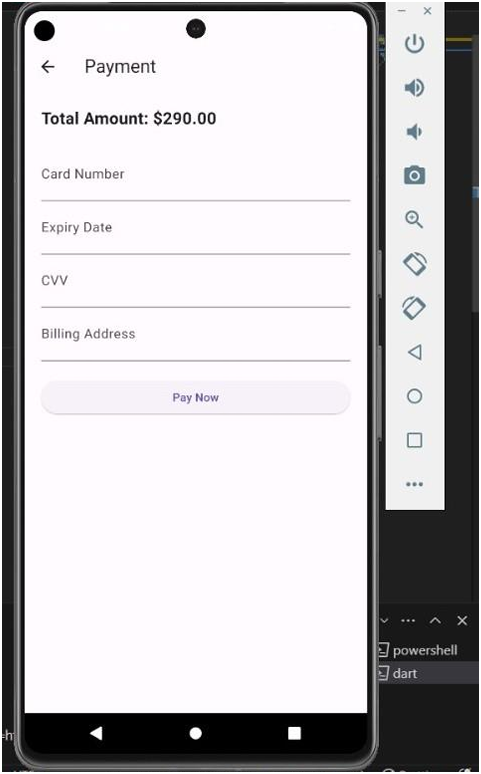
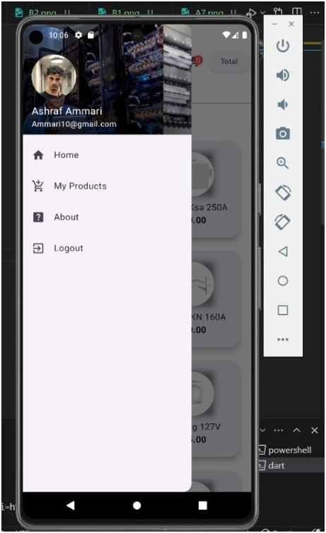
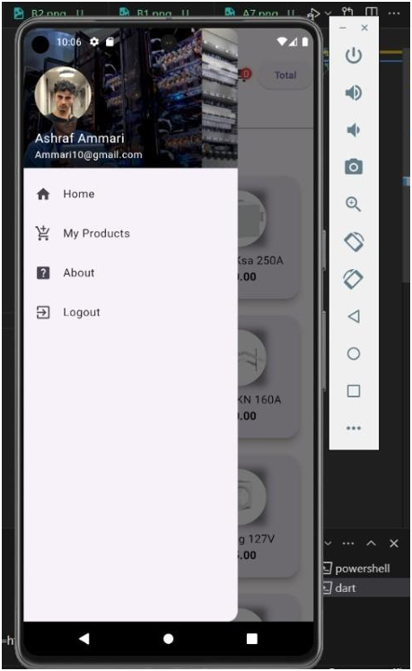
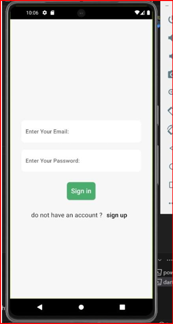

Application Mobile de Vente de Produits Automatisés
Ce projet est une application mobile développée en Flutter dans le cadre de [votre entreprise, ex : Schneider Electric]. L'application vise à simplifier la vente de produits d'automatisation industrielle en fournissant une plateforme intuitive pour les utilisateurs.

L'application permet aux utilisateurs de parcourir, sélectionner et acheter divers produits d'automatisation. Elle offre une interface fluide pour gérer l'inventaire, suivre les commandes et recevoir des notifications, optimisant ainsi l'expérience d'achat.

Fonctionnalités
Catalogue de Produits : Visualisation des produits disponibles, triés par catégories et caractéristiques.
Recherche Personnalisée : Fonction de recherche avec filtres avancés pour aider les utilisateurs à trouver des produits spécifiques.
Gestion de Commandes : Ajout de produits au panier, récapitulatif des commandes et suivi de leur statut en temps réel.
Notifications Push : Notifications pour informer des nouvelles offres et promotions.
Support Client : Assistance via l’application pour répondre aux questions des utilisateurs.
Technologies Utilisées
Framework : Flutter (Dart)
Backend : Firebase / REST API
Base de Données : Cloud Firestore
Autres : Git, CI/CD (selon votre configuration DevOps)  
 

